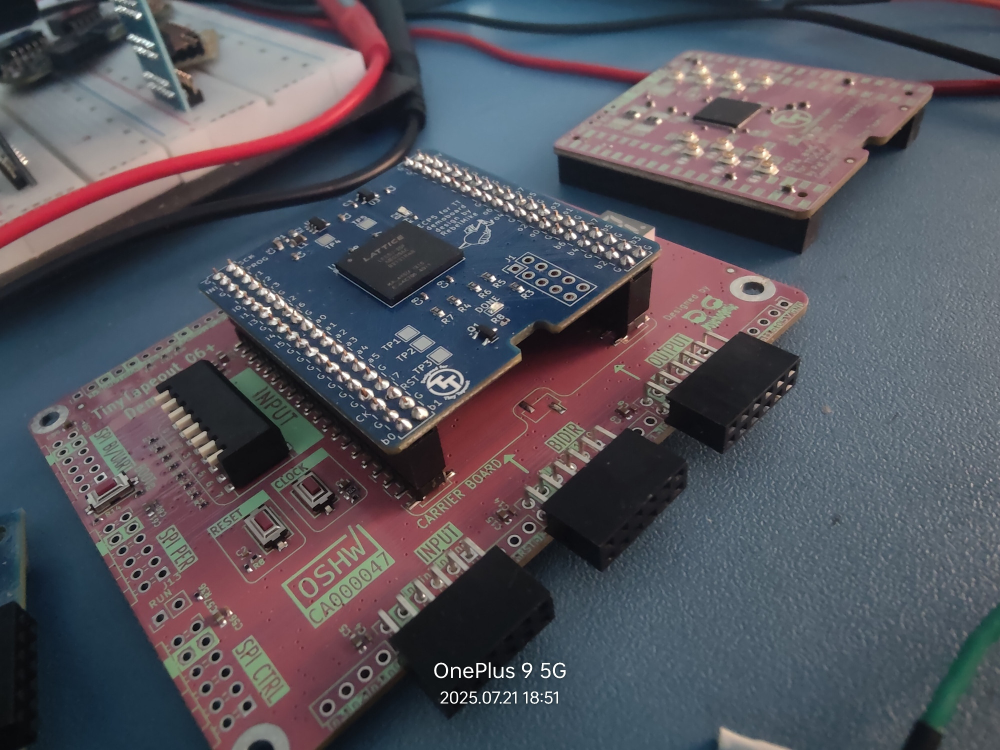
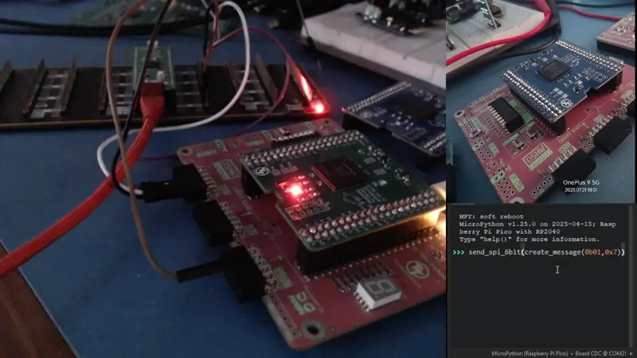

# spi-slave-to-7segLED
A demo written for experimental Tiny Tapeout ECP5 prototyping board.
## Description

The design implements a SPI-slave device for seven-segment display on TT base board. TT FPGA controls seven-segment display via spi-slave and the RP2040 just sends it a 6-bit message to light up the LEDs.

## How to run this design
You'll need a 
(i) TinyTapeout Demo Board, 
(ii) TinyTapeout ECP5 Breakout Board and 
(iii) Raspberry Pi Pico.



## Build and Program
While in the source directory do this -
```bash
cd ./programmer
make
make prog
```

You can also manually take the bit-file(from above make process) and feed to programmer.

```bash
python -m mpremote connect COM20 mount . + exec "import os; os.chdir('/remote'); import ecp_prog; ecp_prog.execute('spi_7seg.bit')"
```

## Upload micropython firmware

Copy micropython i.e. ``micropython/main.py`` to micropython filesystem. Use Thonny IDE or any appropriate REPL shell to use the command below -

```python
 send_spi_6bit(create_message(0b01,0xE))
 ```

When you're done, this is how it is supposed to show output -

